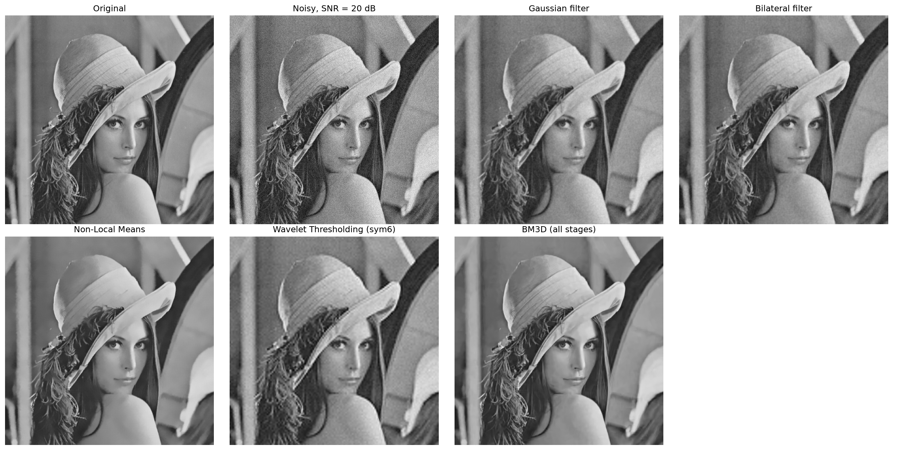

# Classical Image Denoising

Comparative analysis of five classical image denoising methods, evaluated
quantitatively on a grayscale image corrupted by additive Gaussian noise at a
controlled SNR.

[](https://colab.research.google.com/github/louisgomes-pe/classical-image-denoising/blob/main/notebooks/denoising_methods.ipynb)

---

## Problem

Given a clean grayscale image $i$ degraded by additive white Gaussian noise
independent of the image content, the goal is to recover an estimate as close
as possible to the original. The noise power is calibrated to reach a target
SNR of 20 dB, following

$$P_n = \frac{P_i}{10^{\text{SNR}/10}}$$

Reconstruction quality is measured against the clean reference using MSE and
PSNR, so that methods are compared on objective criteria rather than on visual
inspection alone.

## Methods implemented

| Method | Prior exploited | Domain |
|---|---|---|
| Linear Gaussian filtering | Local smoothness | Spatial (FFT convolution) |
| Bilateral filtering | Local smoothness + intensity similarity | Spatial |
| Non-Local Means | Non-local patch self-similarity | Spatial |
| Wavelet thresholding | Sparsity in a fixed transform basis | Wavelet (Haar from scratch + PyWavelets) |
| BM3D | Non-local self-similarity + transform sparsity | 3D patch groups |

The Haar wavelet transform is implemented from scratch (forward and inverse,
multi-level dyadic decomposition) before switching to PyWavelets, which provides more advanced wavelets. 

## Results

All methods are evaluated on the **same noisy realization** of the image (fixed
random seed), so differences reflect the methods themselves rather than
variation in the noise draw.

| Method | MSE | PSNR (dB) |
|---|---|---|
| BM3D (all stages) | 21.83 | 34.74
 |
| BM3D (hard-thresholding) | 24.77	 | 34.19 |
| Non-Local Means | 30.16 | 33.34 |
| Wavelet thresholding (sym6, soft) | 69.81 | 29.69 |
| Bilateral filter | 39.04 | 32.21 |
| Gaussian filter | 48.71 | 31.25 |



BM3D produces the most faithful reconstruction, both visually and
quantitatively, best preserving fine structures and edges. This is consistent
with its design: it exploits non-local self-similarity across 3D groups of
similar patches combined with collaborative filtering, a strictly more
expressive prior than the purely local (Gaussian, bilateral), single-patch
(NLM), or fixed-basis (wavelet) approaches.

## A note on comparison fairness

Hyperparameters were not obtained the same way for every method, and the
ranking should be read with that in mind:

- **Gaussian, bilateral, NLM** were tuned by grid search against the
  ground-truth image. This is an oracle procedure, infeasible in practice.
- **BM3D** was given the true noise standard deviation. This is by design:
  `sigma_psd` is meant to reflect the actual noise level rather than act as a
  free smoothing knob.
- **Wavelet thresholding** used a fixed basis (sym6) and level (2), with the
  threshold estimated from the noisy coefficients themselves via Donoho's
  universal threshold. No ground-truth information was used.

Each setup is a best case for its method, but they are not strictly comparable
procedures, so this is not a controlled ablation over a single shared tuning
protocol.

## Limitations

- A single test image (Lena) and a single noise level explored in depth (20 dB)
- Synthetic additive Gaussian noise rather than real sensor noise
- No runtime comparison, though BM3D is substantially slower than the others
- The Gaussian filter's optimal $\mu$ falls at the lower bound of the tested
  grid, so a finer search below 1 would be needed to confirm it is a true
  optimum rather than an artifact of the search range

## Repository structure

```
classical-image-denoising/
├── README.md
├── requirements.txt
├── data/
│   └── lena.png
├── assets/
│   └── comparison_grid.png
└── notebooks/
    └── denoising_methods.ipynb
```

## Installation

```bash
git clone https://github.com/USERNAME/classical-image-denoising.git
cd classical-image-denoising
python3 -m venv venv
source venv/bin/activate      # Windows: venv\Scripts\activate
pip install -r requirements.txt
jupyter notebook notebooks/denoising_methods.ipynb
```

## References

- Buades, Coll & Morel (2005), *A non-local algorithm for image denoising*
- Dabov, Foi, Katkovnik & Egiazarian (2007), *Image denoising by sparse 3D
  transform-domain collaborative filtering*
- Donoho & Johnstone (1994), *Ideal spatial adaptation by wavelet shrinkage*
- Tomasi & Manduchi (1998), *Bilateral filtering for gray and color images*

## License

MIT
